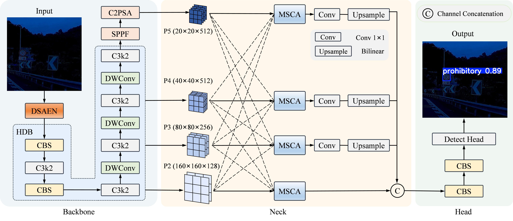

# DD-LTSNet
DD-LTSNet: A Detection-Driven Framework with Dual-Stream Enhancement and Multi-Scale Consensus Aggregation for Low-Light Traffic Sign Detection
🔥(2026 IEEE RA-L under review)

## Model Architecture



## 🚀 Getting Started

## Installation

1. Clone the repository
   ```bash
   git clone https://github.com/zzt007/DD-LTSNet.git
   cd DD-LTSNet
   ```

2. Create a virtual environment
   ```bash
   conda create -n dd-ltsnet python=3.8
   ```

3. Install requirements
   ```bash
   pip install -r requirements.txt
   (optinal you can install the Simplified Verison)
   ```

## Train
1. Our model configuration is stored in the DD-LTSNet.yaml file.

2. Train the model
   ```bash
   python train.py
   ```

## Test
1. Test the model
   ```bash
   python test.py
   ```
